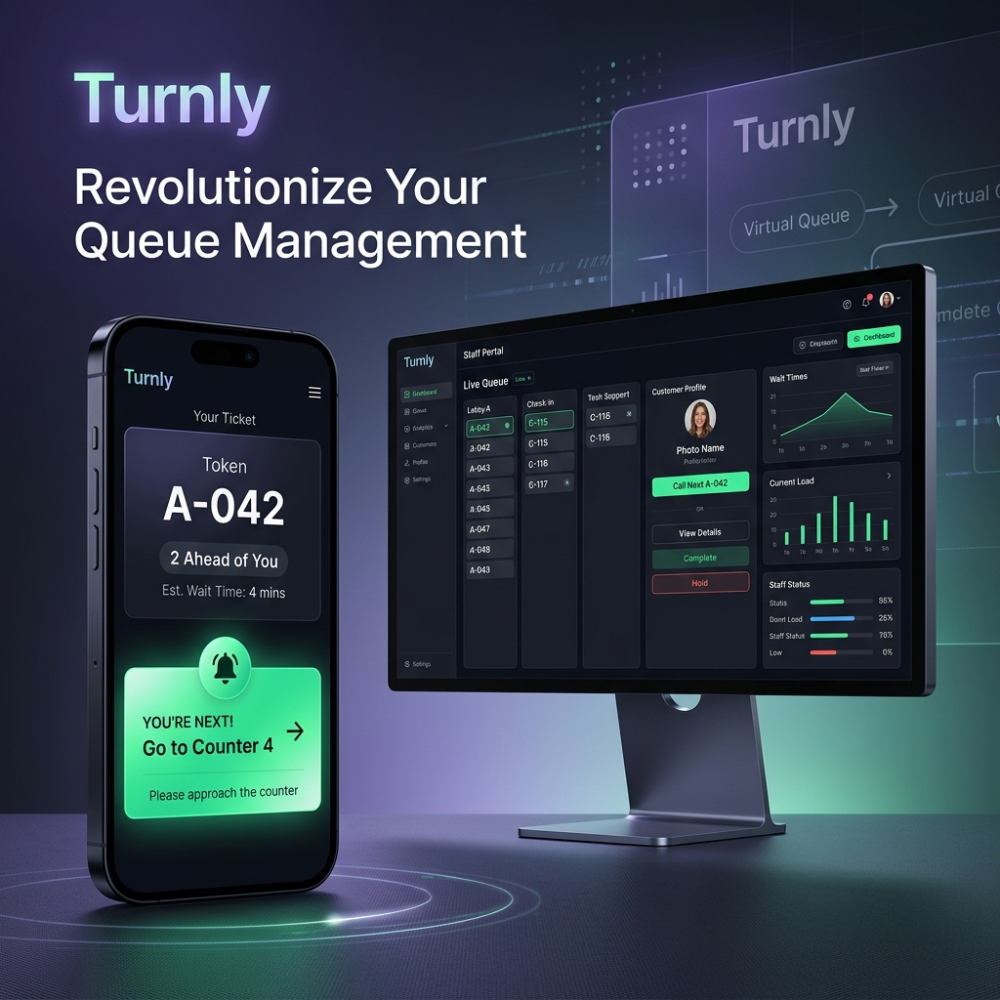

# ⚡ Turnly — Multi-Tenant Virtual Queuing SaaS

<div align="center">



### **Smart Digital Queues for Modern Businesses**
*Eliminate physical waiting lines with instant QR-based virtual queues, real-time ticket tracking, staff dispatch dashboards, and waiting room TV displays.*

[](https://nextjs.org/)
[](https://reactjs.org/)
[](https://firebase.google.com/)
[](https://tailwindcss.com/)
[](https://vercel.com/)
[](LICENSE)

[**Live Demo**](https://turnly-queue-saas.vercel.app) • [**Report Bug**](https://github.com/parthm56/turnly/issues) • [**Request Feature**](https://github.com/parthm56/turnly/issues)

</div>

---

## 📌 Project Overview & Use Case

**Turnly** is a high-performance, multi-tenant virtual queuing SaaS designed for physical venues such as **dental & medical clinics, busy restaurants, salons, banks, and government service centers**. 

Instead of forcing customers to stand in crowded physical lines or crowd waiting areas, Turnly allows guests to **scan a venue QR code on their smartphone**, enter their party details, and receive a **live digital ticket token** with real-time status updates, dynamic wait estimations, audio chime alerts, and web push notifications.

### 🏢 Target Use Cases
- 🏥 **Healthcare & Dental Clinics**: Keep waiting rooms clear and notify patients when their doctor/chair is ready.
- 🍔 **Restaurants & Cafes**: Manage party size reservations, walk-in table queues, and takeaway pickups seamlessly.
- 💇 **Salons & Spas**: Track stylist availability and walk-in client sequences.
- 🏦 **Banks & Financial Hubs**: Route clients to designated service counters without ticket dispensers.
- 🏛️ **Government & Admin Offices**: Reduce overcrowding with real-time counter calling and kiosk screens.

---

## ✨ Key Features

- 📱 **Zero-App-Download QR Entry (`/b/[businessSlug]`)**: Customers simply scan a physical QR poster at the venue entrance using their phone camera to join the line.
- 🎫 **Live Customer Ticket Tracker (`/b/[businessSlug]/ticket/[ticketId]`)**: Real-time ticker showing position in line ("2 ahead of you"), estimated wait time, party size, and dynamic status badges.
- 🖥️ **Staff Dispatcher Dashboard (`/dashboard/[businessSlug]`)**: Counter operators can call the next guest, mark completed, put on hold, or re-queue tickets with 1-click action triggers and audio chime feedback.
- 📺 **Waiting Room TV Scoreboard (`/tv/[businessSlug]`)**: Fullscreen 1080p kiosk scoreboard for wall-mounted TV screens with chime sound broadcasts for counter announcements.
- 🏬 **Multi-Tenant URL Routing**: Instant business registration producing custom branded venue routes (e.g. `/b/apex-dental` or `/b/burger-house`).
- ⚡ **Dual-Engine Realtime Core**: Powered by **Firebase Firestore** with atomic transactions (`runTransaction`) and **Firebase Realtime Database**, paired with an automatic client-side local storage fallback for offline demo resilience.
- 🔔 **Web Push Notifications & Audio Chimes**: Native Web Push alerts (FCM) and synthesized Web Audio API sound chimes when a customer's turn is called.

---

## 🛠️ Architecture & Tech Stack

```
                     ┌──────────────────────────────────────────────┐
                     │           TURNLY SAAS PLATFORM               │
                     └──────────────────────┬───────────────────────┘
                                            │
         ┌──────────────────────────────────┼──────────────────────────────────┐
         ▼                                  ▼                                  ▼
┌─────────────────┐                ┌──────────────────┐               ┌─────────────────┐
│ Customer Mobile │                │ Staff Dispatcher │               │ TV Kiosk Screen │
│  (QR Ticket)    │                │   (Dashboard)    │               │  (Waiting Room) │
└────────┬────────┘                └────────┬─────────┘               └────────┬────────┘
         │                                  │                                  │
         └──────────────────────────────────┼──────────────────────────────────┘
                                            │
                                            ▼
                          ┌──────────────────────────────────┐
                          │     Next.js 14 App Router        │
                          │   React 18 + Tailwind CSS        │
                          └─────────────────┬────────────────┘
                                            │
                                            ▼
                          ┌──────────────────────────────────┐
                          │   Firebase Realtime & Firestore  │
                          │   - Atomic Duplicate Locks       │
                          │   - Multi-Tenant Isolation       │
                          │   - Web Push & Audio Chimes      │
                          └──────────────────────────────────┘
```

| Layer | Technology | Description |
| :--- | :--- | :--- |
| **Frontend Framework** | **Next.js 14 (App Router)** | Server & Client Components, Dynamic Routing, Fast Refresh |
| **UI & Styling** | **Tailwind CSS + Lucide Icons** | Custom Glassmorphism, Responsive Grid System, Accessible UI |
| **Realtime Database** | **Firebase Firestore & RTDB** | Multi-tenant collection isolation, live snapshot listeners |
| **Authentication** | **Firebase Auth** | Anonymous guest auth + Manager Email/Password login |
| **Push Notifications** | **FCM & Service Worker** | Web Push API integration (`firebase-messaging-sw.js`) |
| **Audio Engine** | **Web Audio API** | Dynamic synthesized chime notifications for queue calls |
| **State Management** | **React Hooks & Custom Store** | Optimistic UI updates with offline fallback engine |

---

## 👨‍💻 Developer Showcase & Core Competencies

This project demonstrates expertise across modern full-stack software development:

### 1. 🚀 Full-Stack SaaS Engineering
- Designed and built a production-ready, multi-tenant web application from scratch using **Next.js 14**, **React 18**, and **Firebase**.
- Structured clean, modular codebase separated by UI components, database engines, security protocols, audio synthesis, and notification service workers.

### 2. ⚡ Real-Time Concurrency & Data Integrity
- Implemented real-time Firestore listeners (`onSnapshot`) to deliver sub-second state synchronization across mobile, desktop, and kiosk screens.
- Utilized atomic Firestore transactions (`runTransaction`) to guarantee duplicate ticket locks, sequence consistency, and race condition prevention.

### 3. 🎨 Premium UI/UX & Responsive Design
- Crafted modern glassmorphic interface designs with dark/light themes tailored for 3 distinct form factors: Mobile Smart Phones (375px PWA), Staff Desktops (1440px), and Waiting Room Kiosks (1920x1080).
- Focused on micro-animations, party size selector pills, live status counters, and zero-friction guest onboarding.

### 4. 🔒 Multi-Tenant Security & Resilient Architecture
- Configured production Firebase Security Rules (`firestore.rules`, `database.rules.json`) strictly isolating tenant datasets by business slug and manager UID.
- Developed a hybrid storage architecture featuring client-side local fallback state, ensuring zero application crashes during offline testing or API quota limits.

---

## 🚀 Quick Start & Installation

### Prerequisites
- **Node.js**: `v18.0.0` or higher
- **npm** or **yarn** / **pnpm**
- **Firebase Account** (optional for production database sync)

### 1. Clone the Repository
```bash
git clone git@github.com:parthm56/turnly.git
cd turnly
```

### 2. Install Dependencies
```bash
npm install
```

### 3. Configure Environment Variables
Create a `.env.local` file in the root directory by copying `.env.example`:
```bash
cp .env.example .env.local
```

Fill in your Firebase credentials in `.env.local`:
```env
NEXT_PUBLIC_FIREBASE_API_KEY=your_api_key
NEXT_PUBLIC_FIREBASE_AUTH_DOMAIN=your_project.firebaseapp.com
NEXT_PUBLIC_FIREBASE_PROJECT_ID=your_project_id
NEXT_PUBLIC_FIREBASE_STORAGE_BUCKET=your_project.appspot.com
NEXT_PUBLIC_FIREBASE_MESSAGING_SENDER_ID=your_messaging_sender_id
NEXT_PUBLIC_FIREBASE_APP_ID=your_app_id
NEXT_PUBLIC_FIREBASE_DATABASE_URL=https://your_project.firebaseio.com
```

### 4. Run Development Server
```bash
npm run dev
```

Open [http://localhost:3000](http://localhost:3000) in your browser to view the application.

---

## 📄 Application Page Directory

| Route | Target Device | Description |
| :--- | :--- | :--- |
| `/` | Desktop / Mobile | **SaaS Marketing Landing Page** with live demo showcases, features bento grid & calculator |
| `/auth/register` | Desktop | **Business Registration** & custom URL slug generation |
| `/auth/login` | Desktop | **Staff Login** for dashboard access |
| `/b/[businessSlug]` | Mobile PWA | **Customer Branded Join Portal** with QR code entry & party size selector |
| `/b/[businessSlug]/ticket/[id]` | Mobile PWA | **Customer Live Ticket Tracker** with real-time wait counter & push alerts |
| `/dashboard/[businessSlug]` | Desktop | **Staff Dispatcher Dashboard** for managing lines, calling tokens, & analytics |
| `/tv/[businessSlug]` | Fullscreen 1080p | **Waiting Room TV Kiosk Scoreboard** with live counter audio chimes |

---

## 📜 License

Distributed under the **MIT License**. See `LICENSE` for more information.

---

<div align="center">

Developed with ❤️ by **[Parth](https://github.com/parthm56)**

*If you found this project inspiring, please give it a ⭐️ on GitHub!*

</div>
